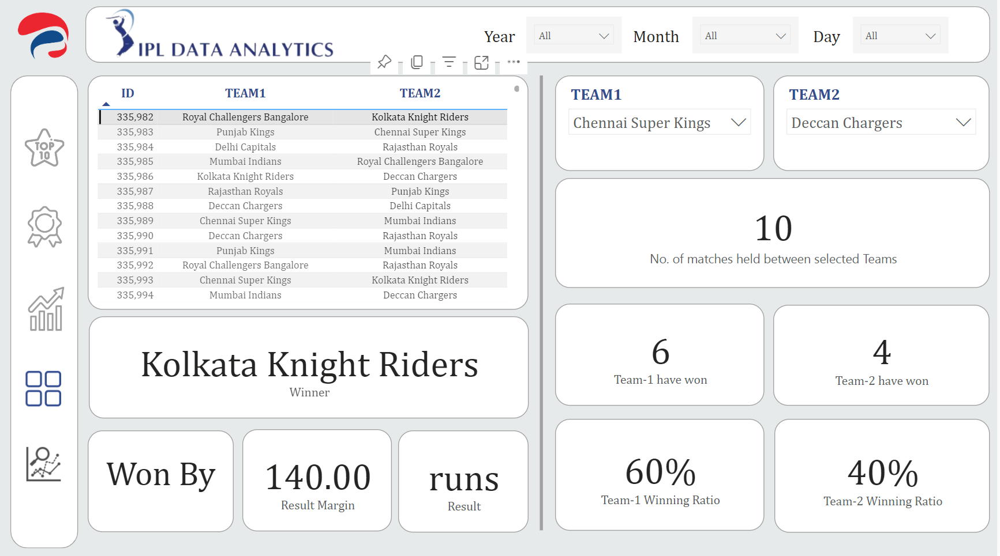

# IPL Data Analytics
<b>Abstract: <i>We have a Indian Premier League dataset from the year 2008-2020. This dataset is not in ready to use format and not good enough to give better visualization of data. We have to extract, load and transform our data. we need to  explore of several technologies to build a solution.</i></b>

<b>Services & Tools used: </b>
- Azure Data Lake Storage Gen2
- Azure Data Factory
  - a. Linked Service
  - b. Pipeline
  - c. Dataset
  - d. Copy Data Activity
  - e. Script
  - f. Web
  - g. Delete 
- Azure Logic App
- Azure Key Vault
- Snowflake & Snowpark
  - a. Data Warehouse
  - b. Database
- Power BI Desktop & Service 

<b><i>High Level Architecture:-</i></b>

</img>

<b><i>Flow Diagram:-</i></b>

</img>

<b><i>Transformed Table:-</i></b>

</img>

<b><i>Visualization (Output):-</i></b>

</img>

</img>

</img>

</img>

</img>

<b>❤️ Found this project useful?</b>

If you found this project useful, then please consider giving it a "⭐" on GitHub and sharing it with your friends via social media.

